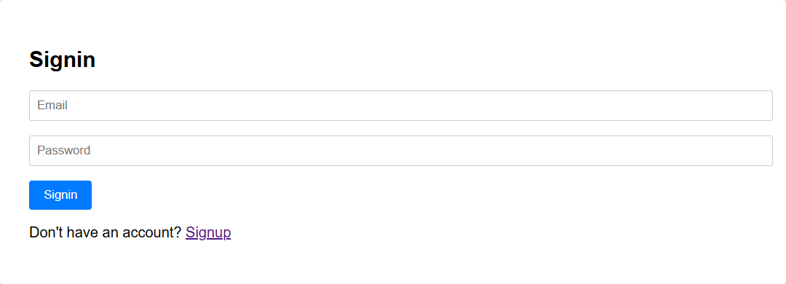
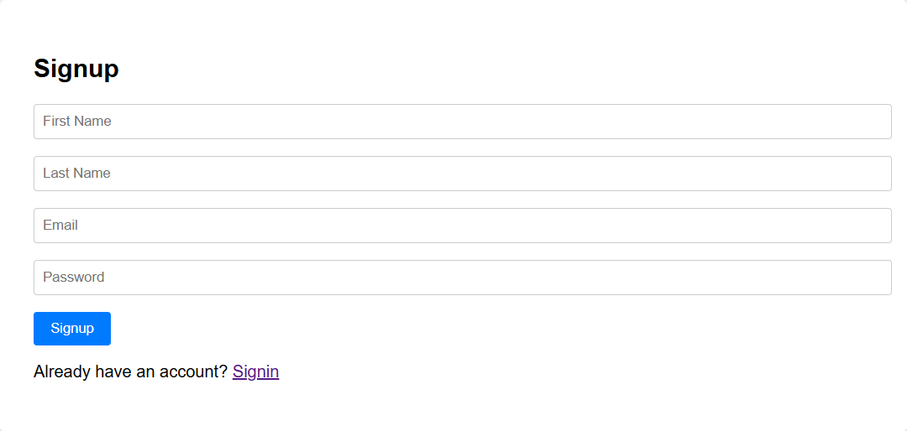
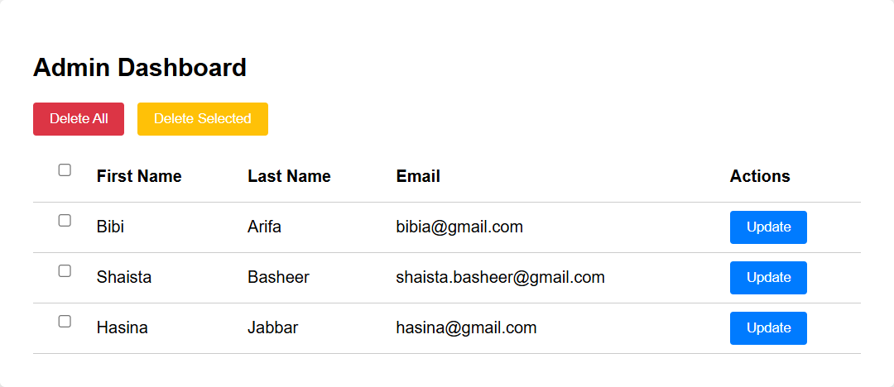

# API Testing Project

This project provides a complete solution for user management, including a backend API and a frontend interface. It's designed to demonstrate basic CRUD operations and user authentication.

## Technologies Used

- **Backend:** Node.js, Express.js, Mongoose, MongoDB
- **Frontend:** HTML5, CSS3, JavaScript
- **API Testing:** Postman

## Folder Structure

- `backend/`: Contains the Node.js Express server, API routes, and MongoDB integration.
- `frontend/`: Contains the static files for the user interface, including HTML pages, CSS stylesheets, and JavaScript for client-side logic.
- `postman/`: Contains a Postman collection for testing the backend API endpoints.

## Screenshots

### Sign-in Page


### Sign-up Page


### Users Table


## Setup and Running the Project

To get this project up and running on your local machine, follow these steps:

### 1. Clone the Repository

```bash
git clone https://github.com/muhammad-huzaifa-coderzhunt/fullstack-web-basics.git
cd fullstack-web-basics
```

### 2. Backend Setup

Navigate to the `backend` directory and install the dependencies:

```bash
cd backend
npm install
```

Start the backend server:

```bash
node server.js
```
The backend server will typically run on `http://localhost:3000`.

### 3. Frontend Access

The frontend is served statically by the backend. Once the backend server is running, you can access the frontend by opening your web browser and navigating to:

- **Signup Page:** `http://localhost:3000/signup.html`
- **Signin Page:** `http://localhost:3000/signin.html`
- **Users Page:** `http://localhost:3000/users.html` (requires login)

### 4. API Testing with Postman

A Postman collection is provided to help you test the backend API endpoints.

1. Open Postman.
2. Import the `Users Management.postman_collection.json` file from the `postman/` directory.
3. You can now use the imported collection to send requests to the API endpoints (e.g., create users, get users, update users, delete users).